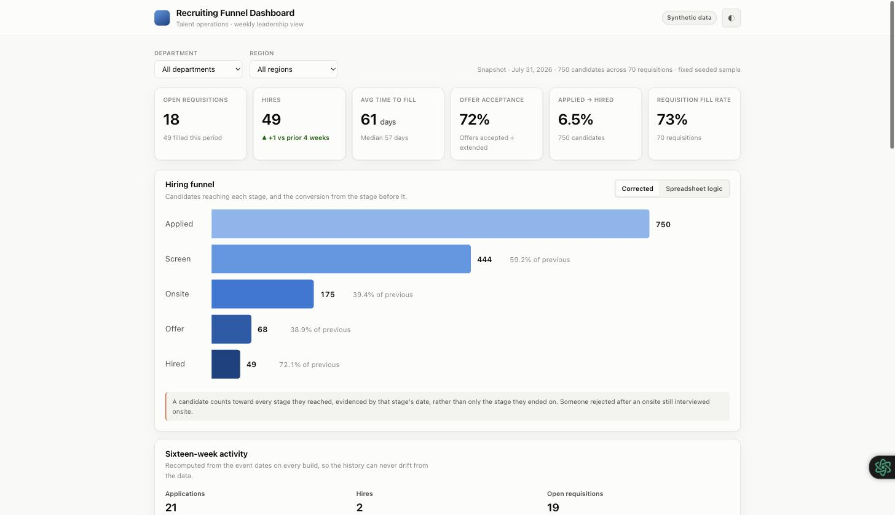
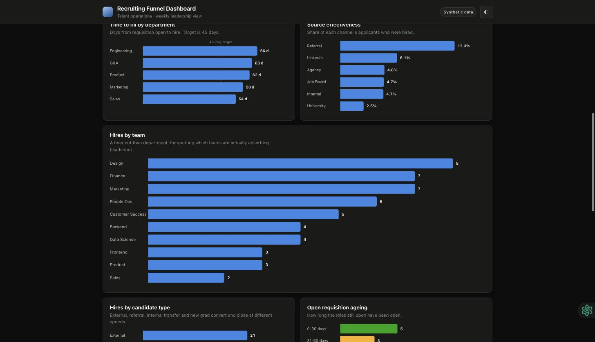

# Recruiting Funnel Dashboard

A recruiting-operations reporting pipeline: synthetic ATS data in, a validated
metric layer in the middle, and three delivery surfaces out — an interactive web
dashboard, a Google Sheets workbook, and an automatically generated weekly
leadership deck with a written executive summary.

**[▶ Open the live dashboard](https://gantaaa.github.io/recruiting-funnel-dashboard/)**

[](https://gantaaa.github.io/recruiting-funnel-dashboard/)

> **Everything here is synthetic.** The data is generated by
> [`generate.py`](src/recruiting_funnel/generate.py) from a fixed seed. This was
> never connected to a live applicant tracking system and contains no real
> candidate, employee or company information. It exists to work through how
> recruiting-operations analytics is actually built — the funnel maths, the
> metric definitions, the reporting cadence, and the automation around them.

---

## The problem

Every Monday, a recruiting-operations analyst exports a CSV from the ATS,
rebuilds the same pivot tables, recolours the same cells, and pastes screenshots
into a deck for the leadership review. It takes hours, it is easy to get wrong,
and by the time anyone sees the numbers they are stale and carry no explanation
of *why* time-to-fill moved.

This replaces that loop: the metrics are computed once and reused everywhere,
the deck builds itself, and the narrative is drafted from the actual figures.

## What is here

| | |
|---|---|
| **[Live dashboard](https://gantaaa.github.io/recruiting-funnel-dashboard/)** | Funnel, velocity, source effectiveness, requisition ageing, data quality. Filters by department and region, light and dark themes, works on a phone. |
| **[Metric layer](src/recruiting_funnel/metrics.py)** | Every KPI, defined exactly once. 48 tests pin the definitions. |
| **[Validation](src/recruiting_funnel/validate.py)** | 11 data-quality rules that run over the raw CSV before any metric is computed. |
| **[Generator](src/recruiting_funnel/generate.py)** | Seeded synthetic data where requisitions are real entities and funnel dates are monotonic. |
| **[Apps Script](apps_script/Code.gs)** | The weekly job: snapshot → narrative → Slides deck → email, on a Monday trigger. [A real run's output](apps_script/example-output.md), and what it got wrong. |
| **[Workbook](workbook/)** | The original Google Sheets implementation, 15 tabs. Preserved unfixed as the "before" — [its numbers are wrong on purpose](workbook/README.md). |
| **[Portfolio write-up](docs/portfolio-writeup.md)** | The long-form version: design decisions, KPI reasoning, interview notes. |

## Quick start

No dependencies. Python 3.11+.

```bash
git clone https://github.com/Gantaaa/recruiting-funnel-dashboard
cd recruiting-funnel-dashboard

make test        # 48 tests, no install step
make validate    # data-quality report
make dashboard   # regenerate dashboard.json
make serve       # http://localhost:8000
```

`make all` runs the whole pipeline: generate → validate → export.

## What auditing my own workbook found

I built the first version of this as a Google Sheets workbook, so everything
below is an audit of my own work. Before building anything on top of it, I
wrote the validation layer and pointed it at my own data. The workbook's own
Data Quality tab — which I also wrote — reported **99.75% health**. The audit
found:

| Finding | Scale | Consequence |
|---|---|---|
| Requisitions whose rows disagreed about their own department, region and open date | **49 of 50** | `Requisition_ID` is the join key for every requisition-level metric. Time-to-fill was subtracting a randomly-assigned open date from a real hire date. |
| The funnel derived stage depth from `Current_Stage` | all 400 rows | Everyone rejected or withdrawn collapsed back to "Applied". Applied→screen read **59.2%** against a true **81.5%**. |
| Impossible calendar dates stored as text (`2026-02-29`, `2026-01-33`) | 4 | Spreadsheets compare text to dates without erroring, so the date-logic check passed them. |
| One requisition counted as both open and filled | 1 | Requisition totals summed to 51 for a dataset containing 50. |
| A whole department missing from every breakdown | 50 rows | Department lists on the dashboard tabs were hardcoded. |
| Recruiter tab listing four recruiters who appear nowhere in the data | 4 rows | Names came from a worked example. Every row read zero, and nothing errored. |

The last one is the one I think about most. It rendered a clean, well-formatted
table of four names, every value zero, and looked completely normal.

Each finding is now pinned by a test. The funnel panel on the dashboard has a
**Corrected / Spreadsheet logic** toggle so the difference is something you can
see rather than something I assert — on the current dataset the same bug reads
13.9% against a true 59.2%, because it bites harder the more candidates drop
out mid-funnel:



Details in [docs/data-quality.md](docs/data-quality.md).

## How it fits together

```
generate.py → recruiting_data.csv → validate.py → metrics.py ─┬→ export.py → web dashboard
                                                              ├→ Google Sheets workbook
                                                              └→ Apps Script → Slides + email
```

**A KPI is defined once, in [`metrics.py`](src/recruiting_funnel/metrics.py).**
Everything downstream renders it. The dashboard contains no analytical logic —
even its filters swap between slices Python pre-computed, rather than
recalculating in the browser. That is what stops the funnel tab and the
executive tile from quietly disagreeing about what "conversion" means.

More in [docs/architecture.md](docs/architecture.md).

## Metric definitions worth calling out

**Time to fill vs. time to hire.** Time-to-fill runs `Req_Open_Date → Hire_Date`
(the business clock — how long the seat sat empty). Time-to-hire runs
`Application_Date → Hire_Date` (the candidate clock). Both are reported, because
a team can improve one while the other gets worse, and only one of them is a
candidate-experience metric.

**Reaching a stage is evidenced by that stage's date, not by `Current_Stage`.**
Someone rejected after an onsite still interviewed onsite.

**"Headcount vs Plan" was renamed.** The formula was `Filled ÷ (Open + Filled)`,
which is a fill rate. Headcount versus plan needs a plan to compare against, and
there isn't one in the dataset.

**The weekly trend is recomputed from event dates, never accumulated.** The
original appended a row per run to a snapshot tab whose first eight rows were
typed in by hand — they claimed ~300 open requisitions against a dataset that
had 14. Deriving the history means it backfills correctly and cannot drift.

Full list in [docs/kpi-definitions.md](docs/kpi-definitions.md).

## Repository layout

```
├── data/
│   ├── recruiting_data.csv            the working dataset (750 rows, validates clean)
│   └── recruiting_data_original.csv   the original export, kept so the audit stays checkable
├── src/recruiting_funnel/
│   ├── schema.py      field dictionary, controlled vocabularies, funnel definition
│   ├── generate.py    seeded synthetic generator
│   ├── dataset.py     CSV → typed rows, with schema-drift rejection
│   ├── validate.py    11 data-quality rules
│   ├── metrics.py     every KPI, defined once
│   └── export.py      metrics → dashboard.json
├── apps_script/       the weekly report automation
├── docs/              the GitHub Pages dashboard + written documentation
├── tests/             48 tests, standard library unittest
└── workbook/          the original Google Sheets workbook
```

## Extending it to a real ATS

`dataset.load()` is the seam. It returns `list[Row]`, and everything downstream
depends on that shape and nothing else. Pointing this at Greenhouse, Lever or
Workday means writing one function that returns `list[Row]` from their API; the
metrics, validation, tests, export and dashboard are unchanged.

## Notes

Python is standard library only — no `pip install` before `make test`, and CI
needs no resolver step. For 750 rows and a fixed set of aggregations, pandas
would add a dependency without adding capability.

Dashboard colours come from a validated palette: the categorical slots clear
colour-vision-deficiency and normal-vision separation thresholds in both light
and dark themes, and the funnel's ordinal ramp clears monotonic lightness and
step separation. Every chart carries direct labels, a hover tooltip, keyboard
focus, and a table view.

---

Gantamir Gankhuyag · [ggankhuy@ucsc.edu](mailto:ggankhuy@ucsc.edu)
